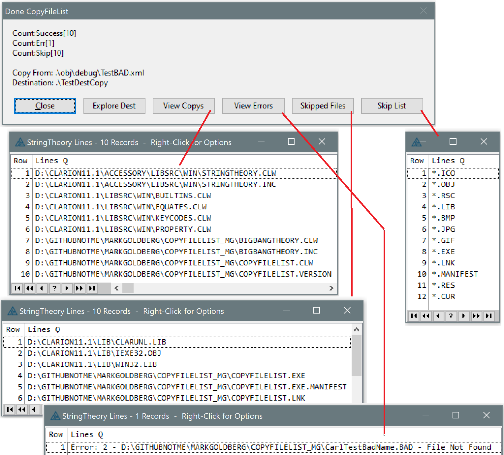

# CopyFileList
Command line util to copy files listed in FileList.xml 

Carl Barnes fork adds his Big Bang Theory class, see more info at bottom.

Usage
------
C:\> CopyFileList From=%FileList% To=%Folder% [Exclude="%CommaDelimWildcards"] [/SkipCommon] [/Debug] [/Bang]


---
**/SkipCommon**

adds several exclusions to the exclusion list. 
```'*.ICO,
    *.OBJ,
    *.RSC,
    *.LIB,
    *.BMP,
    *.JPG,
    *.GIF,
    *.EXE,
    *.LNK,
    *.MANIFEST,
    *.RES,
    *.CUR
```

---
**/Debug**
Will write messages to OutputDebugString (ODS)

My favorite ODS viewer is [DebugViewPP](https://github.com/CobaltFusion/DebugViewPP)

---
**/Bang**
Display StringTheory object values using [BigBangTheory class](https://github.com/CarlTBarnes/StringTheory-LoadFile-Split-Viewer)
 to help understand and debug what your calls to ST are doing.
 These display in a window that is resizable and has features to copy the data, view in hex and more.

Examples
---------
```c:\> CopyFileList```

Error, will show a usage window

---


```c:\> CopyFileList From=C:\Src\MyProj\Obj\Debug\MyProj.cwproj.FileList.XML  To=C:\Src\MyProj\Profile```

will copy all files in the Opened Files section of the FileList.xml

---


```c:\> CopyFileList From=C:\Src\MyProj\Obj\Debug\MyProj.cwproj.FileList.XML  To=C:\Src\MyProj\Profile /SkipCommon```

will copy all files in the Opened Files section of the FileList.xml, except those with common extensions

---


```c:\> CopyFileList From=C:\Src\MyProj\Obj\Debug\MyProj.cwproj.FileList.XML  To=C:\Src\MyProj\Profile Exclude="ctQ*.*,AB*.*" /SkipCommon```

will copy all files in the Opened Files section of the FileList.xml, except those with common extensions, and additionally skip any files matching `ctQ*.*` or `AB*.*`

---


```C:\Src\MyProj> CopyFileList From=.\Obj\Debug\MyProj.cwproj.FileList.XML  To=.\Profile```

Run a BAT file from within the project folder so you can use relative paths .\Obj...

__________________

# Carl Barnes Fork CopyFileList

Fork adds my [Big Bang Theory class](https://github.com/CarlTBarnes/StringTheory-LoadFile-Split-Viewer)
 to show extra debug in windows. Run with the /Bang switch to see these.

The Success message below has buttons to view a list of files
 in window that were Copied, Errored or Skipped.
 These lists are StringThreory object lines viewed with
 one call to ```BigBang.LinesViewInList(STobject)```.


